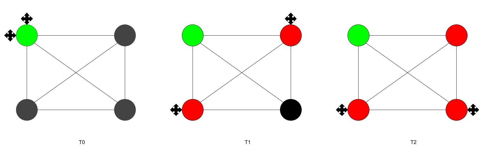
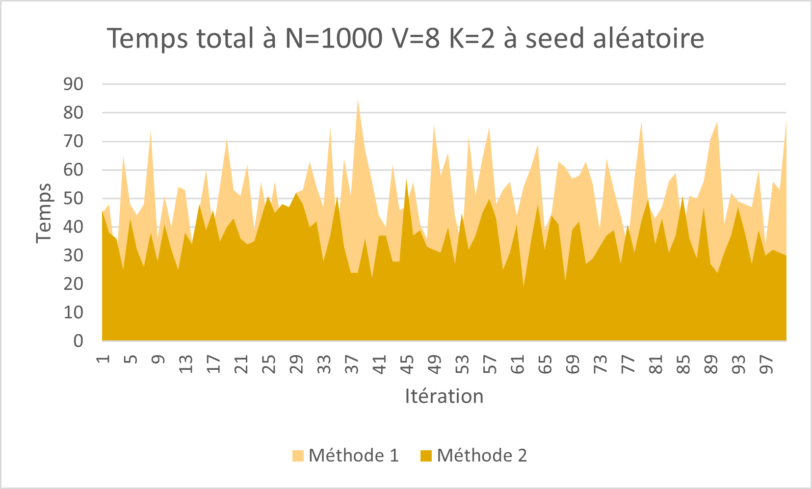
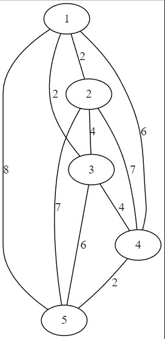
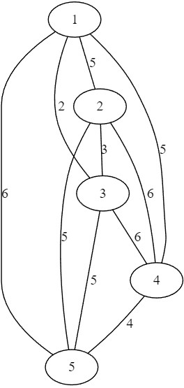
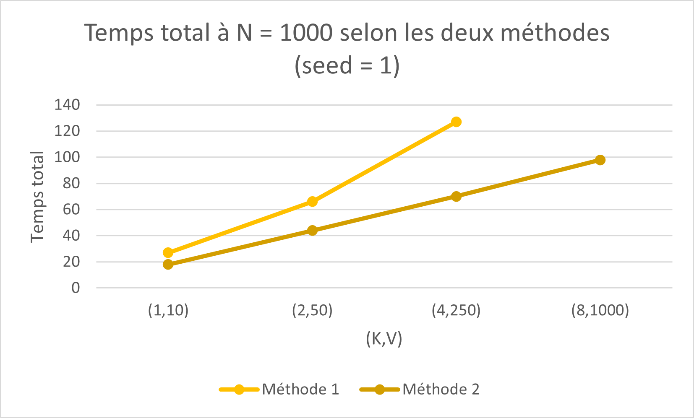

# Rapport algorithmique de graphes
*Esteban Rodriguez, Brandon Dubaquier, Mathys Monello, Romain Pierre*  
Mai 2023


- [Rapport algorithmique de graphes](#rapport-algorithmique-de-graphes)
  - [Introduction](#introduction)
  - [Mise en place](#mise-en-place)
    - [Modélisation](#modélisation)
    - [Algorithme de parcours](#algorithme-de-parcours)
    - [Problème similaire](#problème-similaire)
    - [Temps d'acheminement](#temps-dacheminement)
  - [Encodage du monde](#encodage-du-monde)
  - [Algorithmes](#algorithmes)
    - [Trajet optimal](#trajet-optimal)
    - [Ordre de visite des villages](#ordre-de-visite-des-villages)
      - [Mise en évidence de l'importance des villages dans l'algorithme](#mise-en-évidence-de-limportance-des-villages-dans-lalgorithme)
    - [Comparaison et résultats](#comparaison-et-résultats)
  - [Conclusion](#conclusion)


---

## Introduction
L'objectif de ce projet est de calculer les trajets optimaux d'une flotte de drone pour acheminer des objets entre des villages. On entend par trajets optimaux des trajets minimisant le temps de chaque tournée et le temps d'acheminement d'objet. Les hypothèses faites sont que chaque drone possède une vitesse de déplacement constante unitaire et peut déposer ou ramasser un objet. De plus, on néglige le temps de dépôt ou de ramassage d'un objet et chaque drone connaît les trajets des autres drones.

## Mise en place
Dans cette partie, nous donnons un premier aperçu sur le problème ainsi que sa modélisation en vue de le résoudre.

### Modélisation
Pour modéliser la situation, on se donne deux options :
- Dans un monde sans contrainte, on peut utiliser un graphe où chaque sommet est connecté à tous les autres sommets, car le drone peut se déplacer en ligne droite sans contrainte.
- Dans un monde avec contraintes, on peut utiliser un graphe dont les arêtes représentent les déplacements possibles du drone, soit en utilisant une variante graphe où les arêtes correspondent à des chemins entre les villages, soit en utilisant une variante obstacle où les arêtes ne peuvent traverser les zones interdites par les obstacles.

Il faut aussi, dans les deux cas, stocker d'autres informations comme l'emplacement des villages et des drones, par exemple.

### Algorithme de parcours
Un algorithme de parcours que l'on peut utiliser pour résoudre ce problème est l'algorithme de Dijkstra, qui permet de trouver le chemin le plus court entre deux sommets dans un graphe pondéré. Dans notre cas, les poids des arêtes pourraient représenter les temps de déplacement entre les villages.

### Problème similaire
Le problème de graphe qui ressemble le plus à notre problème est le problème du voyageur de commerce, où l'objectif est de trouver le chemin le plus court passant par toutes les villes visitées une seule fois. Dans notre cas, nous avons plusieurs drones et chaque drone doit effectuer une tournée, mais l'idée est similaire en ce sens qu'il faut trouver un chemin qui minimise la distance parcourue par chaque drone.

### Temps d'acheminement

Dans le cas d'une clique de N sommets avec un poids unitaire pour les arêtes, le temps optimal d'acheminement d'un message d'une source quelconque à tous les N-1 destinations est égal à (N-1)/K + (N-1) mod(K).



Dans le cas où les poids sont hétérogènes, voici les étapes de l'algorithme :

1. Placer les K drones sur la même source.
2. Trier les sommets par ordre croissant de leur distance au drone le plus proche.
3. Parcourir les sommets en ordre croissant et assigner chaque sommet au drone le plus proche.
4. Répéter l'étape 3 jusqu'à ce que tous les sommets soient atteints par au moins un drone.
5. Calculer le temps total d'acheminement en prenant la distance maximale parcourue par un drone.

Dans ce cas, l'algorithme doit prendre en compte le fait que les drones partent tous du même sommet, ce qui peut entraîner une distribution inégale des tâches entre les drones. En effet, les drones les plus éloignés de leur destination peuvent être surchargés, tandis que les drones les plus proches peuvent avoir des capacités inutilisées.

Pour réduire cet effet, il est possible de diviser les sommets en groupes de taille égale et de placer les drones sur différents sommets de chaque groupe. Cela permettra de répartir plus équitablement les tâches entre les drones et d'optimiser le temps d'acheminement global.

## Encodage du monde

Nous décomposons notre problème en deux phases au niveau des graphes. Tout d'abord, lorsque nous créons notre monde, nous le représentons sous forme d'une matrice de taille NxN où N est la largeur du monde.

Nous pouvons donc l'encoder une première fois dans un graphe "monde" de N^2 sommets où chaque sommet admet une arête avec ses voisins directs de poids unitaire. Ainsi, nous pouvons appliquer l'algorithme de Dijkstra depuis chaque village pour obtenir les distances entre les villages en prenant en compte la présence d'obstacles.


Ensuite, nous pouvons créer un graphe "village" plus simple, composé uniquement des villages, sous forme d'une clique où tous les sommets sont reliés par des arêtes 2 à 2. Les arêtes ont pour poids la distance (ou le temps, puisque la vitesse est unitaire) entre les villages. La figure ci-dessous montre le résultat pour le monde de la figure précédente.


---

## Algorithmes

Dans cette partie, nous présentons les algorithmes que nous utilisons sur les différents modèles.

### Trajet optimal

Soit G une clique et D le nombre de drones.

Pour trouver un trajet optimal, on détermine le nombre de sommets S du graphe G et on calcule la fréquence de placements des drones à l'aide de la formule suivante: f_{drones} = ceil(S/D). Ainsi, cela nous permet d'obtenir que l'attente maximale des villageois entre deux passages est max(t_{i}) = f puisque lors de chaque tournée on parcourt chaque village une seule fois en sachant que les drones possèdent un itinéraire prédéfini.

Par conséquent, pour que les messages puissent transiter entre les différents villages, il est nécessaire que les drones partagent au moins 2 villages communs avec deux drones distincts.

On peut donc écrire le programme suivant:

```plaintext
fonction Traj_opt(G: graphe, D: nombre de drones):
    t = 0;
    S = nombre_sommets(G);
    f = ceil(S/D);
    Visit = constructTab(0, S);
    Max_t = constructTab(0, S);
    Drones_pos = position_drones(G);
    
    pour i allant de 0 a taille(Drones_pos):
        Visit[ Drones_pos[i] ] = 1
        drone_parcours[i][0] = drone_pos[i];
    
    tant que tous les villages n'ont pas été visités:
        i = 1
        village_suiv_min_trajet(drones_pos);
        remplir_drone_parcours(drone_parcours);
        i++;
        t++; 

    retourner drones_parcourt;
```
chaque drone visite les villages selon dijkstra afin de visiter les villages les plus proches en comptant que chaque drone visite f villages ce qui permet d'avoir au moins deux villages communs avec deux drones distincts.


### Ordre de visite des villages

Soit V villages et K drones, chaque drone est placé au hasard sur un village unique, nous cherchons à visiter les V-K villages en un temps minimal. Pour ce faire, nous avons réalisé 2 algorithmes gloutons ayant chacun leurs avantages et leurs inconvénients afin de minimiser les quantités d'eaux perdues.

#### Mise en évidence de l'importance des villages dans l'algorithme

Dans cet algorithme, chaque village non visité recherche le drone le plus proche de lui en utilisant le graphe d'adjacence calculé dans la partie 3, comme présenté dans la Figure 3. Cette méthode d'itération présente l'avantage de pouvoir déplacer plusieurs fois un unique drone dans certains cas, plutôt que de forcer le déplacement de tous les drones sur des arcs à poids très forts. Cependant, le potentiel de posséder K drones à notre disposition n'est pas exploité contrairement au second algorithme. Voici son pseudo-code :

```plaintext
fonction village_order_2(graph,village_graph):                                              
    t_loss <- 0
    villages <- liste_des_villages_non_visites(graph) 
    Tant que villages n est pas vide faire :
        t_tot = []  
        Pour chaque drone faire :
            (t_min,village_index) = village_le_plus_proche_de(drone)
            Deplacer le drone vers le village;
            Ajouter le temps mit pour y aller a t_tot;
        t_loss += max(t_tot)*len(villages)
        t_loss += sum(t_tot)
    return t_loss
```
Dans cette implémentation tous les drones se déplacent en même temps puis attendent que tous les drones soit arrivés à destination. Ainsi à chaque itération la quantité d'eau perdue et la somme des $T_i + max(T_i)*M$.  

### Comparaison et résultats

Pour savoir lequel des deux algorithmes est plus efficace de façon général nous générons 173 mondes aléatoires avec 5 villages et 2 drones. Nous cherchons toujours à minimiser les pertes d'eaux des villages et nous obtenons le tableau suivant :

| T équivalents | T Prog1 | T Prog2 |
|--------------|---------|---------|
|     16       |   33    |   124   |

Nous observons que le programme 2 est meilleur que le premier programme dans 72\% des cas. 
Tandis que le chemin minimal permettant une perte minime de l'eau fournit par le programme 1 est le meilleur dans 19\% des cas. Dans les exemples suivants les drones sont placés au nœud 1 et 2:

Afin de peaufiner cela nous avons ré-itéré l'expérience mais cette fois ci en fixant tous les paramètres (N=1000,V=8,K=2) et nous avons changé la seed (la graine aléatoire) à chaque itération. Voici les résultats selon les deux méthodes avec 1000 itérations.



Nous pouvons voir que globalement, la méthode 2 est en dessous en terme de temps par rapport à la méthode 1 ce qui vient s'accorder avec les résultats précedent.



Temps total pour les fuites méthode 1 :  16 

le village : 3  appelle le drone du village : 1  et met  : 2  minutes pour s'y rendre.

le village : 4  appelle le drone du village : 3  et met  : 4  minutes pour s'y rendre.

le village : 5  appelle le drone du village : 4  et met  : 2  minutes pour s'y rendre.

Temps total pour les fuites méthode 2 : 20 

le drone du village : 1  se déplace vers : 3  en : 2  minutes.

le drone du village : 2  se déplace vers : 5  en : 7  minutes.

le drone du village : 3  se déplace vers : 4  en : 4  minutes.


On observe sur la Figure ci-dessus qu'il est préférable de ne déployer qu'un drone parcourant tous les arcs minimaux plutôt que de déplacer le drone situé sur le noeud 2 qui ne possède que des déplacements en coûts élevés.




Temps total pour les fuites méthode 1 :  22

le village : 2  appelle le drone du village : 0  et met  : 2  minutes pour s'y rendre.

le village : 3  appelle le drone du village : 2  et met  : 6  minutes pour s'y rendre.

le village : 4  appelle le drone du village : 3  et met  : 4  minutes pour s'y rendre.


Détail du calcul de la fuite totale : 

à l'itération 0 : $T_{tot} = 0$.

à l'itération 1 : $T_{tot} = 2*3 = 6 $ car il reste 2 villages à visiter.

à l'itération 2 : $T_{tot} = 6 + 6*1 = 18$ car il ne reste plus qu'un village à visiter.

à l'itération 2 : $T_{tot} = 18 + 3 = 22$.


Temps total pour les fuites méthode 2 :  18 

le drone du village : 1  se déplace vers : 3  en : 2  minutes.

le drone du village : 2  se déplace vers : 5  en : 5  minutes.

le drone du village : 3  se déplace vers : 4  en : 6  minutes.

Détail du calcul de la fuite totale :

à l'itération 0 : $T_{tot} = 0$.

à l'itération 1 : $T_{tot} = 3 + 5 + max(3,5)*1 = 12$ car il ne reste qu'un village à visiter.

à l'itération 2 : $T_{tot} = 12 + 6 = 18$.

On observe sur la figure ci-dessus qu'il est préférable ici de déployer tous les drones en meme temps afin de minimiser le temps. On remarque que moins les arcs sont hétérogènes plus la méthode 2 semble efficace car on se rapproche du cas d'une clique homogène décrite dans le Paragraphe 2.4. 

Une autre expérience que nous avons menée est de fixer la clique de sommet à 1000 (N=1000) et de faire varier simultanément le nombre de village et de drône. Respectivement 1,2,4,8 pour les drônes et 10, 50, 250, 1000 pour les villages comme le sujet nous l'a explicitement demandé.




Les résultats sont très intéressants sur le graphique ci-dessus car nous pouvons voir le temps de calcul selon le couple augmentant significativement. Pour la méthode 2 une courbe plutôt linéaire semble se dessiner cependant la méthode 1 a eu plus de peine à calculer puisque le dernier couple (8,1000) n'a pas pu être calculer en un temps raisonnable. Une courbe exponentielle se devine pour la première méthode. Ces résultats permettent donc de spéculer sur la complexité des deux méthodes.

## Conclusion

Finalement, cette étude nous a permis de montrer qu'il est plus efficace que les drones livrent le village le plus proche d'eux même non visité, en se déplaçant tous sur un différent, plutôt que de laisser le village choisir le drone le plus proche, en permettant selon la situation de déplacer un seul drone plusieurs fois. Il aurait été possible d'améliorer nos algorithmes en faisant en sorte de déplacer les drones indépendamment du temps d'acheminements des autres drones et en implémentant des \emph{cluster} et de partitionner les villages à l'aide d'un algorithme des K-moyennes.
Enfin, nos algorithmes et nos objets que nous manipulons dans notre code ont été conçu de la sorte à pouvoir gérer des obstacles ou des poids différents selon chaque sommets. Nous pourrions donc imaginer des représentations plus poussées comme des sommets mettant plus de temps parcourir en modifiant son poids par exemple.  


